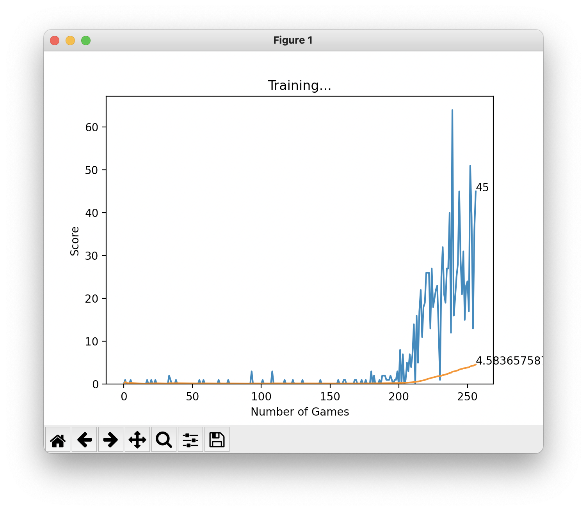
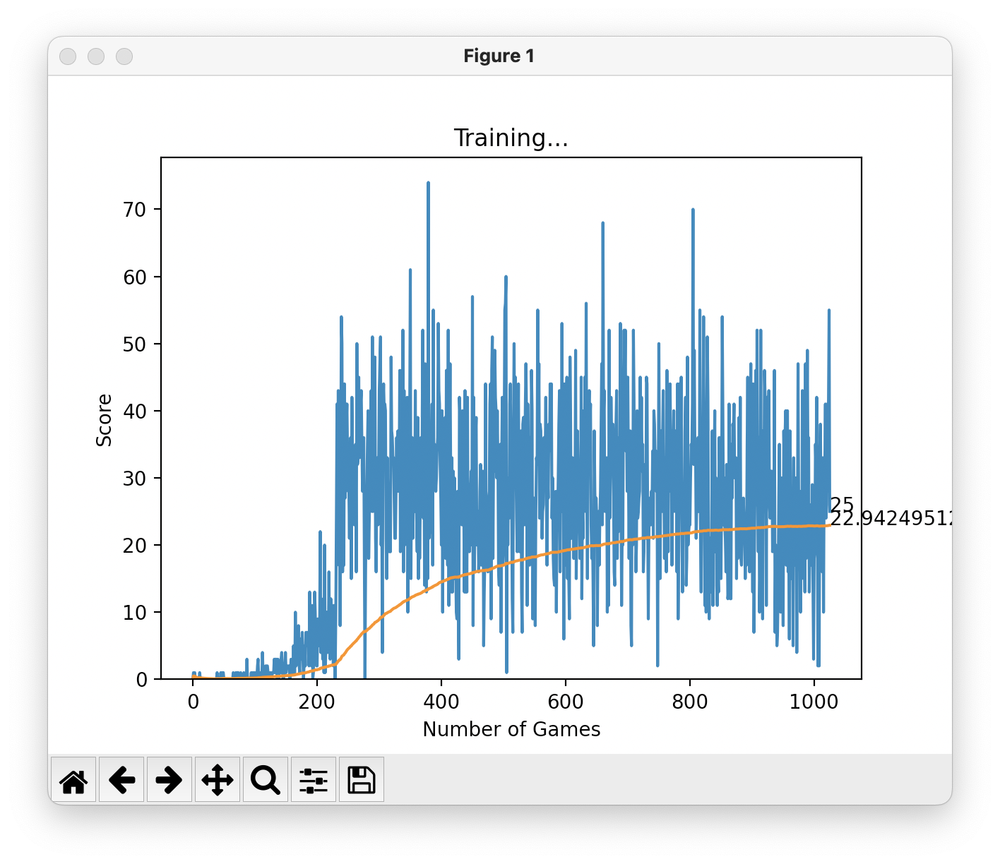

# Snake Game with Machine Learning

This project implements a classic Snake game enhanced with machine learning, allowing an AI agent to play and improve over time using reinforcement learning techniques.

## Features

- **AI-Driven Gameplay**: An intelligent agent learns to navigate the snake to collect food and avoid collisions.
- **Dynamic Learning**: The agent improves its performance through experience, adapting its strategy to maximize the score.
- **Performance Monitoring**: Simple interfaces display the game state and a graph of the agent's performance as it learns.

## Gameplay

1. **Objective**: The AI agent controls the snake to eat the food blocks, increasing its score and length while avoiding collisions with walls and itself.
2. **Movement**: The AI learns to make decisions based on the current game state, without player input.
3. **Learning Mechanism**: The agent uses reinforcement learning to explore the game environment, learning optimal moves over time.
4. **End Condition**: The game ends when the snake collides with the walls or itself. The agent's performance is evaluated based on its score.

## Code Overview

- The project consists of several Python files:
  - **game.py**: Contains the main game logic and the Snake class that implements the game mechanics.
  - **agent.py**: Implements the Agent class, which manages the AI's learning and decision-making processes.
  - **model.py**: Defines the neural network architecture used by the AI to approximate Q-values.
  - **plotter.py**: Visualizes the training progress with plots of scores.

## Requirements

- Python 3.7
- Pygame
- PyTorch
- Matplotlib

## Screenshots

Here are some screenshots of the game in action:

- The AI agent in its initial state.

- The agent successfully eating food.

- The agent colliding with the boundary.

- The agent achieving a high score.

- The training plot after 250 games.

- The training plot after 500 games.

- The training plot after 1000 games.

- The training plot after 1500 games.

- The training plot after 2000 games.
